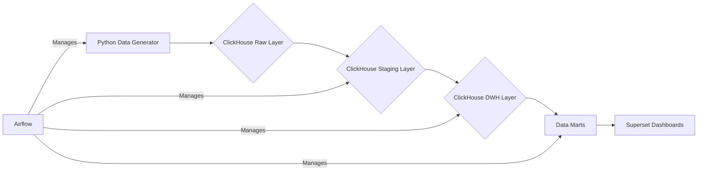

# E-Commerce Analytics Platform

This project is a complete, end-to-end data analytics platform built to provide business intelligence for a simulated e-commerce business. It includes a full ETL pipeline, a data warehouse, and interactive dashboards for analysis.

---
### ## 🏛️ Architecture
The project uses a modern data stack running in Docker containers. The data flows from a raw layer through staging to a DWH and data marts, which are then visualized in Apache Superset.



---
### ## ✨ Key Features
* **Automated ETL Pipeline**: Daily data processing managed by Apache Airflow.
* **Customer Segmentation**: **RFM analysis** (Recency, Frequency, Monetary) to identify key customer segments like "Champions," "Loyal Customers," and "At Risk."
* **Inventory Management**: **ABC-XYZ analysis** to classify products based on their revenue contribution and demand stability, helping to optimize inventory.
* **User Retention Tracking**: **Cohort analysis** to visualize how well the platform retains new users over time.
* **Sales Forecasting**: A simple machine learning model (Prophet) to predict future sales demand.
* **Interactive Dashboards**: A comprehensive BI suite built in Apache Superset to explore all the analyses mentioned above.

---
### ## 🛠️ Tech Stack
* **Data Warehouse**: **ClickHouse**
* **ETL/Orchestration**: **Apache Airflow**
* **BI & Visualization**: **Apache Superset**
* **Containerization**: **Docker & Docker Compose**
* **Core Language**: **Python** (Pandas, Faker, Prophet)

---
### ## 🚀 How to Run
1.  Clone this repository:
    ```bash
    git clone <your-repo-url>
    cd <your-repo-folder>
    ```
2.  Build and start all services using Docker Compose:
    ```bash
    docker-compose up --build -d
    ```
3.  Wait for 2-3 minutes for all services to initialize.
4.  Manually initialize Superset by running the following commands:
    ```bash
    docker exec -it superset superset db upgrade
    docker exec -it superset superset init
    docker exec -it superset superset fab create-admin
    ```
    (Follow the prompts to create your admin user).
5.  Access the services:
    * **Apache Airflow**: `http://localhost:8081`
    * **Apache Superset**: `http://localhost:8088`

---
### ## 📊 Dashboards Showcase
*(**IMPORTANT**: Add screenshots of your best dashboards here!)*

**Executive Overview**


**ABC-XYZ Analysis**


**Cohort Retention Analysis**